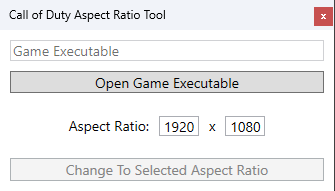

<h1 align="center">
   
  Universal Call Of Duty Aspect Ratio Tool
   
</h1>

  
  
  

<h4 align="center">Aspect Ratio Modifier For Most Call Of Duty Games</a>!</h4>

  

## Usage

1. Download the latest version from **releases**. -->
2. Start Aspect Ratio Tool.exe.
3. Select a executable and click change.
4. Done!

## Support

| Name | Status |
| --- | --- |
| Steam BO2 | ✅ |
| Redacted BO2 | ✅ |
| Steam BO1 | ✅ |
| Steam MW3 | ✅ |
| Steam MW2 | ✅ |
| IW4x | ✅ |
| IW4m | ❌ |
| Steam COD4 | ✅ |
| IW3xo | ✅ |
| COD4x | ❌ |

# Todo
- detect game by getting filename from directory rather than checking if whole directory contains a string. (Would fix a rare case where folder is named incorrectly example: "\t6mpv43\iw3xo.exe")

## Credit
- [Egoulet](https://stackoverflow.com/questions/5132890/c-sharp-replace-bytes-in-byte)
- [jjxtra](https://github.com/jjxtra/HexAndReplace)

---

**Please contact me if you find any bugs or have any suggestions.**
#### Twitter: @kruumy
#### Discord: kruumy#9443
